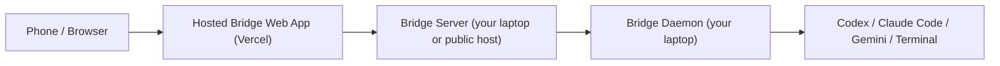

# Bridge

Bridge turns your laptop into a remotely accessible CLI station.

It gives you:

- a hosted web app for phone and desktop access
- a local server that manages pairing, state, and realtime relays
- a local daemon that runs Codex, Claude Code, Gemini, and terminal sessions
- a CLI that can start the local stack, expose it publicly, and show a QR + code
- a phone-first session UI with inbox, machine controls, and mobile session views

Bridge is built so the web app can live on Vercel while the actual machine control stays on your laptop.

## What It Is

Bridge is not just a web UI.

It is a 4-part system:

- `bridge-cli`: the command you run locally
- `bridge-server`: the local backend and realtime relay
- `bridge-daemon`: the local machine/session runtime
- `app-web`: the hosted Next.js frontend

## How It Works



Important:

- the Vercel app is only the frontend
- the local Bridge server is the real backend
- the daemon is what actually runs sessions on your machine

By default:

- Bridge server: `http://127.0.0.1:8787`
- Bridge daemon: `http://127.0.0.1:8790`

If the server is only local, `bridge` can create a public LocalTunnel URL and embed that URL into the QR so the hosted app knows where to connect.

## Current Hosted Frontend

- Production app: [https://bridge-cli.vercel.app](https://bridge-cli.vercel.app)
- Alternate deployed alias: [https://app-web-sand.vercel.app](https://app-web-sand.vercel.app)

## Quick Start

If you are working from this repo:

```bash
pnpm install
pnpm build
pnpm --filter @bridge/server dev
pnpm --filter bridge-daemon dev
pnpm --filter bridge-cli exec bridge
```

That will:

1. start the local Bridge server if needed
2. start the local Bridge daemon if needed
3. create a public tunnel when your server is only local
4. print a QR code and a 6-digit pairing code
5. send you into the hosted web app flow

## The Main Flow

The intended front door is:

```bash
bridge
```

That now defaults to host mode.

It will:

- check the local server
- check the local daemon
- start missing services
- create a public tunnel when needed
- print a QR code
- print the numeric pairing code below it

You can also run it explicitly:

```bash
bridge host
```

## Useful Commands

Start pairing without full host mode:

```bash
bridge connect
```

Manual code login:

```bash
bridge login --code 123456
```

Health check:

```bash
bridge doctor
```

List machines:

```bash
bridge machines
```

Start an agent session:

```bash
bridge session start --machine <machine-id> --agent codex --cwd "$PWD"
```

Start a terminal session:

```bash
bridge terminal --machine <machine-id> --cwd "$PWD"
```

Attach to a session:

```bash
bridge session attach <session-id>
```

Attach to a terminal:

```bash
bridge terminal-attach <session-id>
```

## Local Server vs Hosted App

This is the part that trips people up:

- the hosted app is where you open Bridge from your phone
- the local server is what the hosted app talks to

So when you ask “is the server local?”, the answer is:

Yes. Usually.

The normal setup is:

- web app on Vercel
- Bridge server on your laptop
- Bridge daemon on your laptop

If you want the hosted app to reach your laptop from anywhere, you need one of these:

1. a public Bridge server URL
2. a reverse proxy or tunnel
3. Bridge auto-tunnel via LocalTunnel

Bridge currently supports:

- explicit public server URL with `BRIDGE_PUBLIC_SERVER_URL`
- automatic LocalTunnel exposure for local-only servers

## Environment Variables

Frontend:

```bash
NEXT_PUBLIC_BRIDGE_APP_URL=https://bridge-cli.vercel.app
NEXT_PUBLIC_BRIDGE_SERVER_URL=https://your-bridge-server.example.com
```

CLI:

```bash
BRIDGE_APP_URL=https://bridge-cli.vercel.app
BRIDGE_SERVER_URL=http://127.0.0.1:8787
BRIDGE_PUBLIC_SERVER_URL=https://your-bridge-server.example.com
BRIDGE_TUNNEL_SUBDOMAIN=your-preferred-subdomain
```

Server:

```bash
BRIDGE_ALLOWED_ORIGINS=*
```

Or lock it down more tightly:

```bash
BRIDGE_ALLOWED_ORIGINS=https://bridge-cli.vercel.app,https://app-web-sand.vercel.app,http://localhost:3000
```

## Vercel

The web frontend is a Next.js 15 app in `packages/app-web`.

If you want to deploy it yourself:

```bash
pnpm add -g vercel@latest
cd packages/app-web
vercel
```

For this repo, the working Vercel setup uses:

- framework: `Next.js`
- root directory: `packages/app-web`

## Repo Layout

- `packages/app-web`: hosted Next.js frontend
- `packages/bridge-cli`: CLI entrypoint and host/pairing flow
- `packages/server`: local backend and websocket relay
- `packages/daemon-cli`: local machine daemon and session runtime
- `packages/protocol`: shared contracts
- `packages/sdk`: typed client

## Status

Working now:

- hosted Vercel frontend
- QR + numeric code pairing
- auto-pair links with embedded `serverUrl`
- phone-first app shell with `Home`, `Sessions`, `Inbox`, and `Settings`
- session attention states, ownership markers, inbox events, and machine stale detection
- local server + daemon health checks
- terminal and agent session models
- automatic local tunnel support for local servers
- one-command `bridge` host flow
- browser notifications while the app is open

Production/public-host mode:

- keep the frontend on Vercel
- run `packages/server` on a VPS, home server, or Docker host
- use [packages/server/Dockerfile](/Users/zex/Others/Prod/cli%20wrapper/packages/server/Dockerfile) as the starting point

Still worth improving:

- single-package install experience for `bridge`, `bridge-server`, and `bridge-daemon`
- richer browser terminal UX
- persistent public relay story beyond LocalTunnel
- cleaner first-run bootstrap for non-dev users

## Notes

LocalTunnel websocket support reference:

- [https://github.com/localtunnel/localtunnel#readme](https://github.com/localtunnel/localtunnel#readme)
